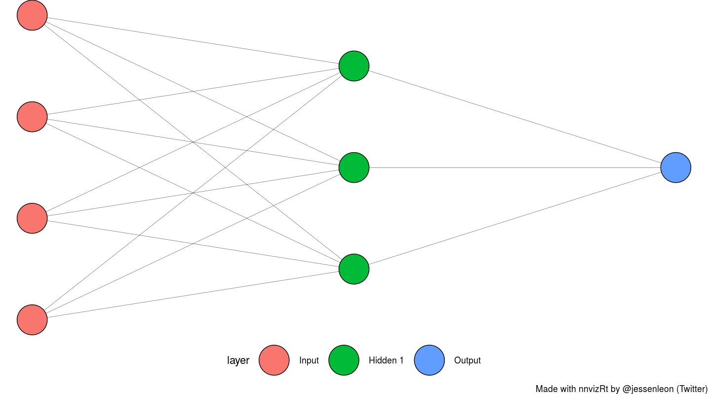

# 2020_group05

## Questions/Agenda for 27-04-2020

* What is the difference between augment and clean - i.e. which parts should be in augment and which should be in clean?

* Are the dataset okay?
* What we imagine we can do with the data
* HAND-IN is **13th of May**

## Description of the data: 
209 observations correspond to blood samples on 192 patients (17 patients have two samples in the dataset)

### Background for study: 
Enzyme levels were measured in known carriers (75 samples) and in a group of non-carriers (134 samples). 
Anomaly of the dataset: 16 out of 17 subjects having two blood samples drawn had differing carrier status for the two observations.

### Goals:
Investigate the chance of a women being a carrier of DMD  based on serum markers and family pedigree. 
Another question of interest is whether age and season should be taken into account. It is of interest to measure how much pk and ld add toward predicting the carrier status. The importance of age and sample date is also of interest.
 
## To do List: 

- [x] Clean data (Contains 8 NAs), make viz of missing data @tkragholm
- [x] Make it up to tidy-format
- [x] PCA analysis for at undersøge hvor mange components beskriver variabiliteten.
- [] See if there is a correlation between level of enzymes and status of women as carriers. Take age + season into account (optional).
- [] Shiny app - Are you a carrier or..?
- [] Add the libraries used in the scripts to the package-vector in **00_doit.R** 

## Plan for project
* Separate the data into 2 groups, so that patients with multiple tests are seperated into a second group (ASTRID)
* Clean data (Contains 8 NAs) (CECILIE)
* Make sure that the data is in tidy-format
* Make a PCA analysis in order to find the correlation between level of enzyme and carrier status
* Add the second group of blood samples to the already-existing patients (make the data into LONG format)
* Make the PCA analysis again to see if there is a new result or if it is still possible to predict carrier status based on enzyme levels
* Make a Shiny app that can predict carrier status based on enzyme levels
* ANN classification model 

* LM classification model

