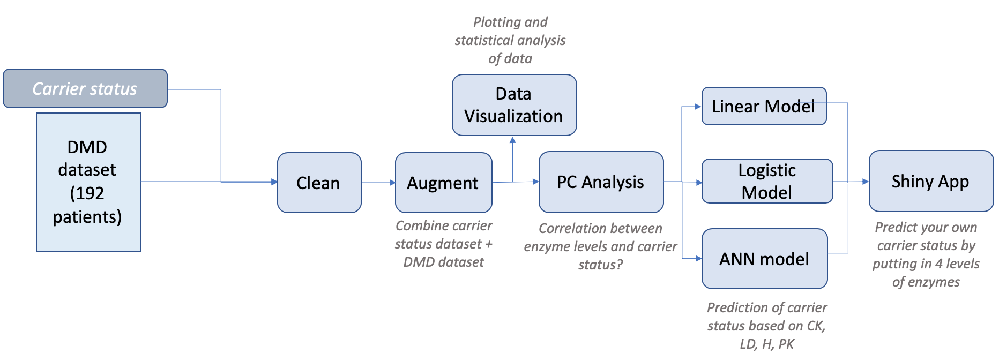
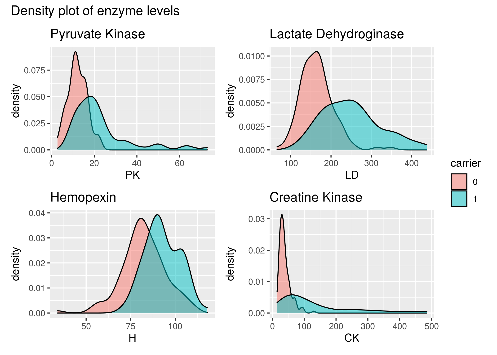
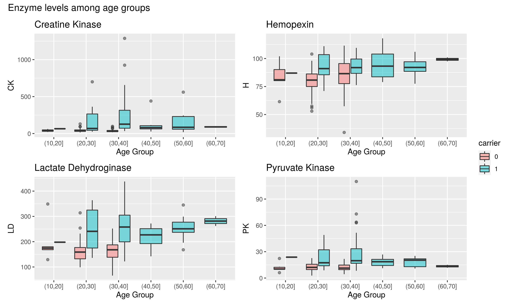
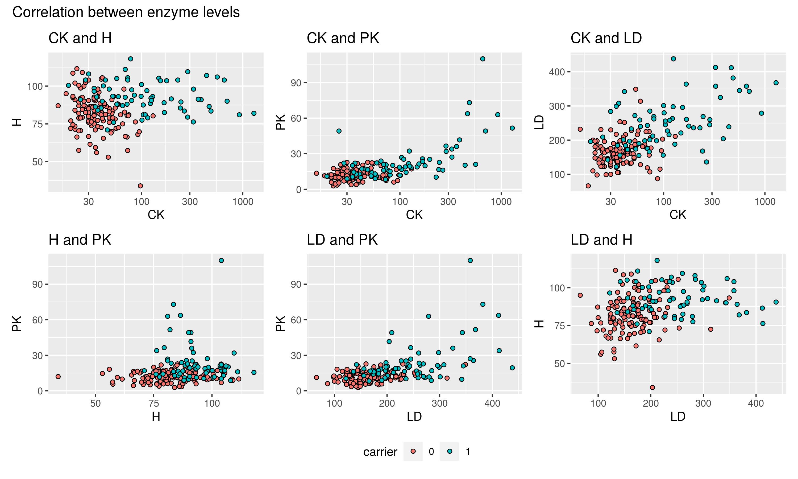
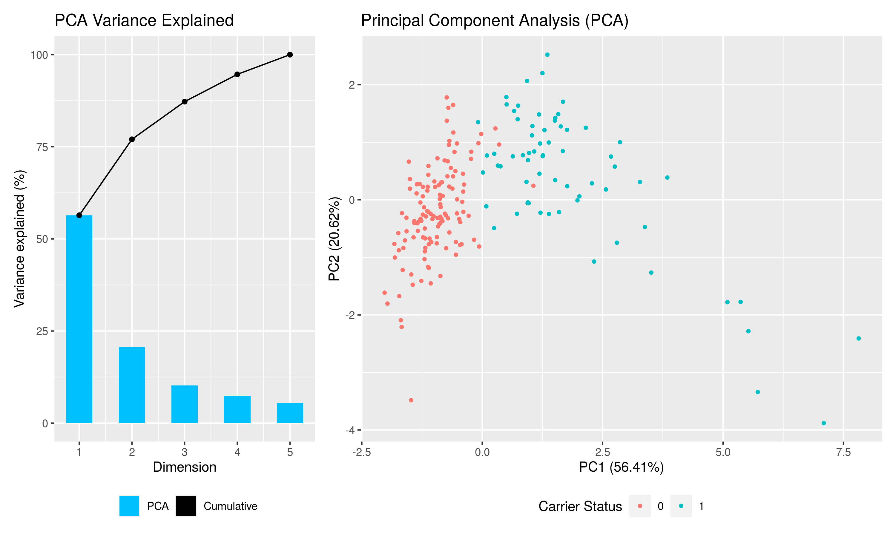

```{r setup, include=FALSE}
knitr::opts_chunk$set(echo = TRUE)
```

## Introduction {.flexbox .vcenter}

* What is Duchenne Muscular Dystrophy (DMD)?
* Hypothesis: Is it possible to predict carrier status based on enzyme levels?
* Today: Genetic testing of X chromosome 


## Materials and Methods | Pipeline for project

<center>

{width=950px}

</center>

<div class="notes">
Gør skriftstørrelse størrere på skrift rundt om bokse.
</div>

## Materials and Methods | Selection and preparation of data
Data set of 192 observations, with 10 attributes after cleaning.

- Collected from the 1985 book 'Data' (@Andrews1985).
- Originated from a 1981 study (@Percy1981). 

Clean

* Removed redundant variables
* Renamed variables
* Changed NA values

Augment

* Add season and carrier status
* Removal of NA's

<div class="notes">
Creatine kinase (CK), Hemopexin (H), Lactate dehydroginase (LD) and Pyruvate kinase (PK)
</div>


##  Materials and Methods | Data set 

```{r include=FALSE}
library('tidyverse')
```
```{r echo=FALSE}
data <- read_tsv(file = "../data/03_aug_data.tsv", 
                 col_types = cols(carrier = col_factor()))
data %>%
  filter(ID < 640 & ID > 630) %>% 
  select(-ObservationNumber)
```

<div class="notes">
Maybe something about the attributes?? 
What are they, is there anything that needs explaning.
</div>


## Results | Descriptive Data Analysis {.flexbox .vcenter}

```{r, echo = FALSE, out.width= "800px"}

```

## Results | Descriptive Data Analysis {.flexbox .vcenter}
```{r, echo = FALSE, out.width = "650px",}

```

<div class="notes">
Not to dare any conclusions from this. It is purely a visualisation of this specific
data set. 
 - We can see an overlap = not two clearly seperate groups
</div>

## Results | Descriptive Data Analysis {.flexbox .vcenter}

```{r, echo = FALSE, out.width = "800px"}

```

<div class="notes">
Decide on what slides we actually want here...

- There is no clear trends in the data
- No obvious correlation between two of the proteins. 

</div>
## Results | Descriptive Data Analysis {.flexbox .vcenter}

```{r, echo = FALSE, out.width = "800px"}

```

<div class = "notes">
- Many outliers, maybe just the dataset is too small
- should we remove them? no...
- No clear trend with age, generally carriers seem to have higher levels of protein
</div>


## Results | PCA {.columns-2 .smaller .flexbox .vcenter}

```{r, echo = FALSE, out.width = "800px"}

```

<div class="notes">
- It is possible to devide the data almost completely

Did we use this in some way?? 
</div>


## Results | Linear and Logistic Regression Model {.flexbox .vcenter}
```{r, echo = FALSE, out.width = "800px"}


```

## Results | Linear Model and Logistic Model {.flexbox .vcenter}

```{r, echo = FALSE, out.width = "900px"}


```

## Results | Artificial Neural Network {.flexbox .vcenter}

```{r, echo = FALSE, out.width = "800px"}
knitr::include_graphics("../results/07_ann_confusion_matrix.png")

```


## Results | Shiny App

https://rforbiodatascience-2020-group5.shinyapps.io/dmd_predictor/ 

## Discussion

- 'Small' dataset 
-  Age as a variable in models
-  Season 
- Cross-validation could improve ANN

## Conclusion
Goal: 
Predict carrier status of Duchenne Muscular Dystrophy in women.

Did we succed: 

  * Linear AUC = 0.92
  * Logistic AUC = 0.945
  * ANN accuracy = 89.5%

## References
